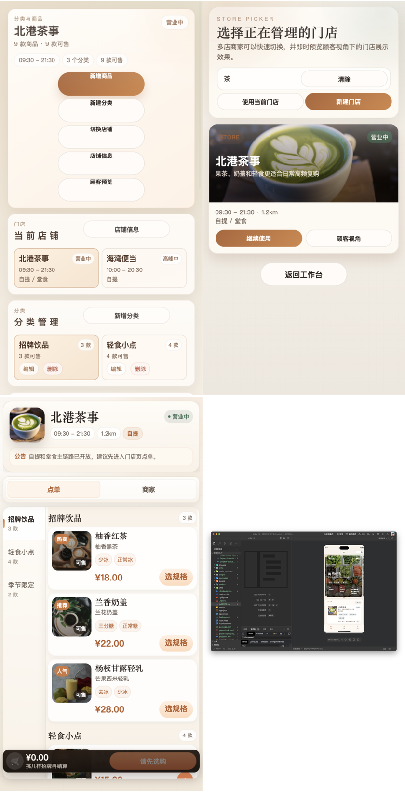
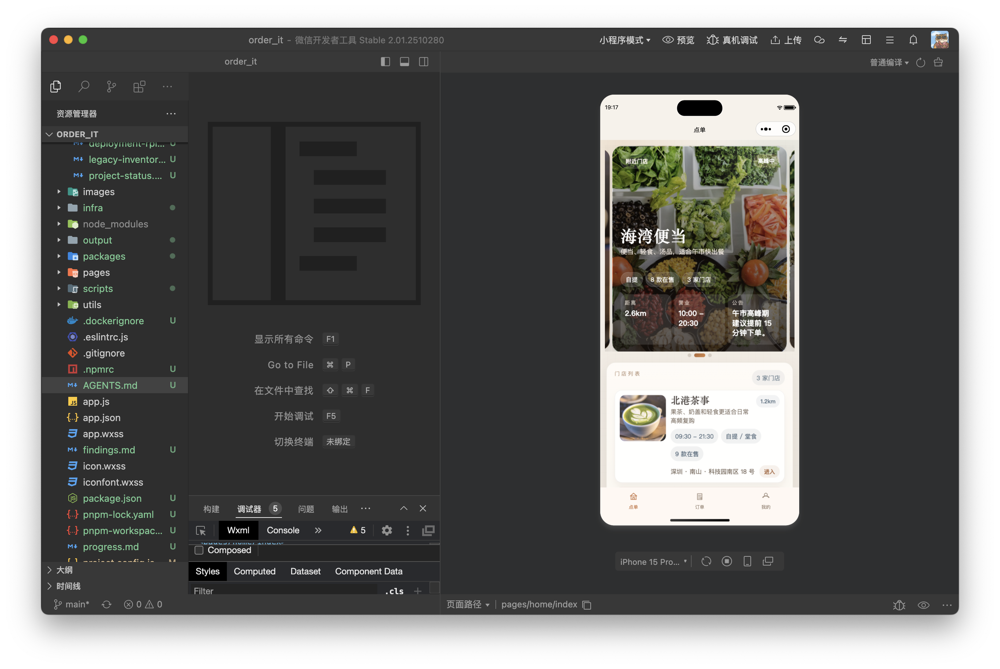

# WeChat DevTools Automator

Beta release candidate for agentic WeChat Mini Program visual debugging inside WeChat DevTools / 微信开发者工具.

Status: Beta release candidate for real Mini Program development workflows with documented smoke runs.

`wechat-devtools-automator` gives agents CLI-powered eyes on real Mini Program pages: run preflight, compile when needed, list routes, open a page with query params, click or type to reach the right state, scroll below the fold, capture screenshots, and collect console / exception output as evidence.

## Beta posture

- Distribution posture today: private beta / direct team sharing
- License posture today: `UNLICENSED` until an explicit open-source or source-available license is added
- Release trust anchors: documented smoke runs, packaged `.skill` artifact, trigger QA summaries, and sharable evidence folders

Before wider sharing, point readers to `LICENSE-NOTICE.md`, `references/install-and-share.md`, `assets/release-checklist.md`, and `references/github-metadata.md` so the beta scope and landing-page copy stay explicit.

## What one run gives you

- a route-aware evidence folder under `<project>/output/wechat-devtools-automator/<run-id>/`
- page screenshots and optional GUI crop
- `report.json` with route, query, action, console, and exception context
- a reproducible CLI trail that another agent or reviewer can rerun

## Why this skill exists

微信小程序前端开发最难的一点，不是“写代码”，而是“看得到”。普通网页可以用 Playwright 直接驱动浏览器，但小程序通常需要经过微信开发者工具这一层。如果 agent 看不到真实页面，很多前端判断都会退化成猜测。

This skill turns that into a repeatable workflow:

- `doctor` to verify the local environment
- `routes` to discover available pages
- `shot` / `scroll-shot` / `gui-shot` to capture real rendered UI
- `--tap`, `--longpress`, `--input`, `--trigger`, `--action` to reach post-interaction states
- `report.json` output with `console` / exception evidence

## What makes it useful

- Real WeChat DevTools loop instead of code-only review
- Route + query opening without project-specific hardcoding
- Interaction primitives for state that appears only after click/input
- Page scroll and inner scroll-container detection
- Cropped DevTools GUI screenshots on macOS, so the simulator stays the focus
- Evidence bundle per run under the target project output directory
- No long-term runtime dependency on `miniprogram-automator`; the skill uses WeChat DevTools CLI automation plus Node built-in `WebSocket`

## Install in 60 seconds

Clone the beta repo into `$CODEX_HOME/skills`, then verify the machine and project immediately:

```bash
export CODEX_HOME="${CODEX_HOME:-$HOME/.codex}"
mkdir -p "$CODEX_HOME/skills"
git clone https://github.com/YogurtJ/wechat-devtools-automator.git \
  "$CODEX_HOME/skills/wechat-devtools-automator"
export WDA="$CODEX_HOME/skills/wechat-devtools-automator/scripts/wechat_devtools_automator.sh"
"$WDA" doctor --project "$(pwd)"
"$WDA" routes --project "$(pwd)"
```

Prefer a packaged `.skill` instead? See `references/install-and-share.md` for repo-clone, packaged install, update, and share options. For current distribution terms, read `LICENSE-NOTICE.md`.

## Quickstart

```bash
export CODEX_HOME="${CODEX_HOME:-$HOME/.codex}"
export WDA="$HOME/.codex/skills/wechat-devtools-automator/scripts/wechat_devtools_automator.sh"

"$WDA" doctor --project "$(pwd)"
"$WDA" routes --project "$(pwd)"
"$WDA" shot --project "$(pwd)" --route "<copy-a-route-from-routes-output>"
```

Artifacts default to:

```text
<project>/output/wechat-devtools-automator/<run-id>/
```

Typical runs save screenshots plus `report.json`.

After you have one real route from `routes`, continue with:

```bash
"$WDA" shot --project "$(pwd)" --route "<real-route>" --query id=item_001
"$WDA" shot --project "$(pwd)" --route "<real-route>" --tap "<selector>"
"$WDA" shot --project "$(pwd)" --route "<real-route>" --input "<selector>::奶茶"
"$WDA" scroll-shot --project "$(pwd)" --route "<real-route>" --scroll-step 900 --scroll-captures 3
"$WDA" gui-shot --project "$(pwd)" --route "<real-route>"
```

Need a safer first-run path? See `references/quickstart.md`.

## Good fit prompts

- “帮我在微信开发者工具里打开这个小程序页面并截图。”
- “先编译一下，再带参数打开指定页面让我看真实渲染。”
- “这个页面得先点一下 tab 才能看到目标状态，帮我点开再截图。”
- “帮我往下滚几屏，把首屏以下也截出来。”
- “打开页面后把 console 报错也一起抓出来。”
- “Open a WeChat Mini Program route with query params and capture screenshots.”

## Demo gallery

See `assets/demo-gallery.md` for the full set. A few representative captures:






## Best used for

- UI validation for 微信小程序 pages
- Visual debugging after route/query changes
- Interaction-driven states that only appear after tapping or typing
- Below-the-fold inspection
- Collecting screenshots and console evidence for agent handoff or bug reports

## 5-minute demo script

Use this when introducing the skill to a teammate or in a repo README:

1. `doctor` to verify machine + project
2. `routes` to show real route discovery
3. copy one route from actual output
4. `shot --route ... --query ...` to prove route/query opening
5. `shot --tap`/`--input`/`scroll-shot` to prove post-interaction capture and below-the-fold inspection
6. Show `report.json` and screenshot folder as evidence bundle

Detailed command flow lives in `references/quickstart.md`.

## Not the right tool for

- Generic website browser automation
- Whole-desktop screenshots unrelated to WeChat DevTools
- Pure code refactors that do not require visual verification
- Skill packaging tasks by themselves

## Limits and known constraints

- Depends on DevTools GUI/session state; parallel runs on one machine can contend
- Visual results can vary by local font/OS/zoom and mock data
- `gui-shot` is macOS-first; simulator/page screenshots are the portable default
- If `build-npm` fails due to missing npm deps in the project, fix project deps first

## Compatibility matrix

| Platform | Node | WeChat DevTools | Validation |
| --- | --- | --- | --- |
| macOS 15.5 | Node v24.13.1 | 2.01.2510280 | `doctor` + `routes` + `shot` + `scroll-shot` on 2026-03-24 |

Record every newly verified platform combo in `assets/release-checklist.md` so this table stays tied to a real smoke-test record instead of guesswork.

## Sharing guidance

- For internal repos: link this README + `references/quickstart.md` for first-run success
- For wider/team release: include demo gallery, `assets/release-checklist.md`, and a `trigger` QA summary in PR/release QA
- For handoff: always share the screenshot folder and `report.json`, not screenshots alone; scrub `report.json` before wider sharing to redact query values, tokens, or personal data
- Before calling it a public/community release, finalize license/repository metadata so distribution posture is explicit
- If you publish a GitHub repo, also fill the repo About box/topics using `references/github-metadata.md`

## Platform notes

- Requires a local WeChat DevTools installation
- Best GUI screenshot experience is on macOS; simulator/page screenshots remain the default and most reliable artifact
- `doctor` is the recommended first command on any new machine or workspace
