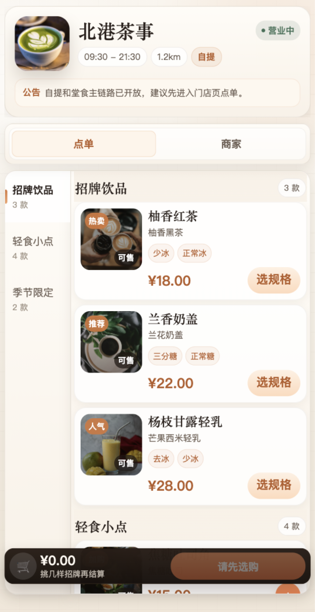
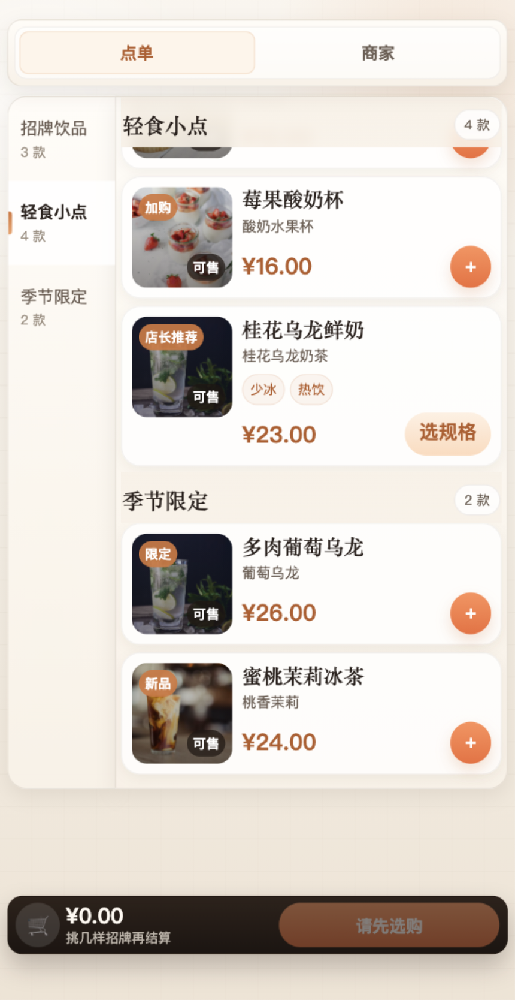

# Demo Gallery

These demo assets show what a user actually receives after one run: a shareable artifact folder, visual proof, and a machine-readable run summary.

## 5-minute success path outcome

If a user follows `doctor -> routes -> shot/scroll-shot`, they should get a timestamped folder containing:
- screenshots
- optional GUI captures
- `report.json` with route/actions/log summary

## Beta release highlights

- CLI flow now stitches together `build`, `routes`, `interact`, `scroll`, and screenshot steps into one command.
- Scroll captures dig into inner containers while keeping automation demand low for agents.
- Console/error harvesting and `report.json` make the run consumable by reviewers and CI systems.
- Demo gallery proves the same artifact tree works for clicks, input, scroll, and GUI-focused screenshots.

## 0. Overview grid

One composite image for repository or marketplace previews.

## 1. Post-click page state

After opening a route, the skill can tap a component before capture so the screenshot reflects the state the user actually cares about.

## 2. Input-driven page state

The skill can type into an input before capture, which is useful for search, filters, pickers, and forms.

## 3. Scroll capture — top

The first scroll capture shows the initial visible state.

## 4. Scroll capture — middle

Subsequent captures make below-the-fold UI visible to the agent.

## 5. Scroll capture — bottom

The run can continue across multiple screens, including inner scrolling containers when auto-detected.

## 6. Cropped DevTools GUI capture

When full DevTools context matters, the skill can capture the GUI while keeping the simulator area central and uncluttered.

## Artifact structure example

See `assets/artifact-example.md` for a concrete directory tree and sample `report.json` fields.

## Why `report.json` is high-value

- Tells reviewers what happened without replaying DevTools manually
- Lets agents/CI parse run facts programmatically
- Connects each screenshot to route/query/actions/log context

## What these demos prove

- A run produces review-ready evidence, not just one image
- Interaction and scroll depth are captured as part of the same run
- Visual output and run metadata can be handed off together
